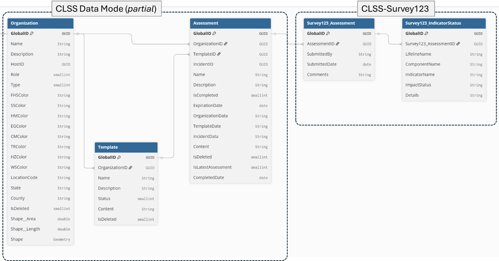

# Concept Paper: Leveraging Survey123 for CLSS

## Background

The Community Lifeline Status System (CLSS) enables emergency managers
to report and monitor the status of critical community services---known
as lifelines---using standardized indicators. Users first configure
templates tailored to specific hazards, defining indicators that assess
various aspects of each lifeline. These indicators are weighted and
prioritized according to agency needs. Next, users conduct Community
Impact Assessments, evaluating each indicator and categorizing
disruptions as Significant, Moderate, Minimal, or Unknown. Based on
these results, lifeline statuses are assigned color codes---Green
(stable), Yellow (functional but inadequate), Red (severely damaged), or
Grey (unknown). Finally, users can share these assessments in real time
and generate reports to support coordinated emergency response and
situational awareness.

## Problem

Some organizations may want to enable users who either do not want to
sign into the CLSS, or do not have ArcGIS Online organization account to
contribute input on indicator statuses.

## Solution: "Side Reporting" via Survey123

To address this, we offer an approach for "side reporting", i.e.,
enabling a Survey123-based process to gather standardized impact
assessments and align these with the CLSS data model. This enables
stakeholders without an ArcGIS login to contribute information linked
to:

- Specific incidents
- Community impact assessments
- Lifelines, components, and indicators

Survey123 is a widely adopted tool based on the ArcGIS platform that
allows users to rapidly design standardized data collection forms.

We developed a method to dynamically generate Survey123 forms via an
ArcGIS Notebook. This solution allows external users to submit indicator
status updates, while preserving alignment with the CLSS data model.

This approach includes:

- A simplified base data model for assessments that aligns with
  indicator framework established in CLSS.
- Automated form creation via Python and the ArcGIS API
- Seamless data integration with CLSS through Assessment ID.

## Technical Approach

### Data Model

**Parent Table: Assessment**
| Field           | Description                             |
| --------------- | --------------------------------------- |
| `globalid`      | Unique identifier for the parent record |
| `assessment_id` | Links to CLSS Assessment ID             |

**Related Table: indicatorStatus**
| Field            | Description                                                       |
| ---------------- | ----------------------------------------------------------------- |
| `globalid`       | Unique identifier for the indicator status record                 |
| `lifeline_name`  | Name of the lifeline (e.g., Communications, Energy)               |
| `component_name` | Specific lifeline component                                       |
| `indicator_name` | Name of the indicator being evaluated                             |
| `impact_status`  | Status of the indicator (Significant, Moderate, Minimal, Unknown) |
| `details`        | Additional context                                                |

### ArcGIS Notebook:

We used an ArcGIS Notebook to automate the Survey123 creation process.
The main features of the notebook include:

- Connect to your ArcGIS Online organization
- Retrieve relevant lifeline templates and indicators
- Generate and publish Survey123 forms on-demand
- Write responses back into the structured data model for integration
  with CLSS
