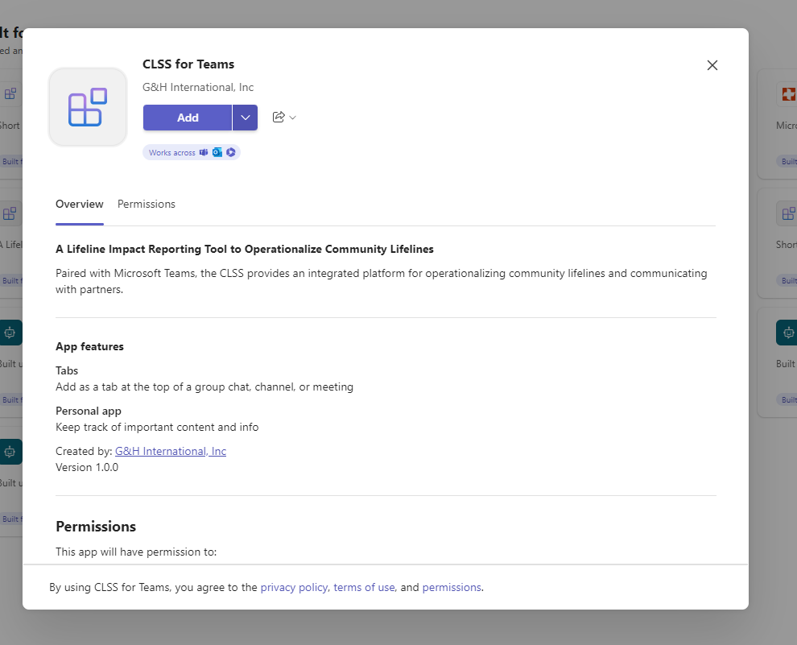

# Concept Paper: Integrating CLSS in Teams

This document outlines the approaches, tradeoffs, and constraints for
embedding the Community Lifeline Status System (CLSS) into Microsoft
Teams. Additionally, it details the process for creating and deploying a
custom Teams app.

## Options for Embedding CLSS into Microsoft Teams

There are limited options for embedding CLSS in Teams. Prior to Summer
2024, web-accessible applications could be embedded directly in teams
tabs; however, this feature has been deprecated to enhance security
through stricter sandboxing and the enforcement of updated web
standards[^1]. While websites, like CLSS, can still be added to a Teams
tab, the user will be forced into a new browser tab when they try to
access it. The solution to avoid this is to embed the CLSS in a custom
Teams Toolkit application and make that application accessible to users
within teams.

**1. Embedding CLSS in a Custom Teams Toolkit App**

- **Overview**: A custom app created using the Microsoft Teams App
  Toolkit can host CLSS as a tab or side panel. This app provides
  flexibility to fully integrate CLSS functionalities.

- **Approach**: Wrap the CLSS web app in a custom Teams app using the
  Teams SDK.

<table>
<colgroup>
<col style="width: 51%" />
<col style="width: 48%" />
</colgroup>
<thead>
<tr>
<th><strong>Pros</strong>:</th>
<th><strong>Cons</strong>:</th>
</tr>
</thead>
<tbody>
<tr>
<td><ul>
<li>
Full control over the app's functionality and integration with
Teams.
</li>
<li>
Can include tenant-specific configurations (e.g., notifications,
user roles).
</li>
<li>
Supports OAuth2 authentication for secure access.
</li>
<li>
Compliant with recent Teams security updates.
</li>
</ul></td>
<td><ul>
<li>
Requires development effort to create and maintain.
</li>
<li>
Cannot directly embed an iframe without additional measures to
meet Teams Store validation requirements.
</li>
<li>
Limited scope if not published to the Teams App Store (e.g.,
organizational use only).
</li>
</ul></td>
</tr>
</tbody>
</table>

- **Use Case**: Best for providing a fully interactive experience for
  CLSS users.

- **Notes**: the oauth settings on the CLSS app needs to force popup to
  dialog (rather than incorporate it directly in the app. This can be
  done by changing the Oauth popup setting: 'popup: false' to 'popup:
  true'. This addresses the x-frame sameorigin error with the clss app
  embedded as an iframe.

- **Cost**: When deploying the Teams Toolkit app based on a ‘basic tab’
  model, the app is automatically assigned to the ‘F1’ (Free) App
  Service Plan.

**2. Embedding CLSS as a Tab in Teams**

- **Overview**: Add CLSS directly to a tab in a Teams channel.

- **Pros**:

  - Easy setup, no customization required.

- **Cons**:

  - Not tightly integrated, user forced into a separate window to access
    CLSS.

- **Use Case**: Suitable for simpler CLSS access without custom
  functionality.

**Process for Publishing a Custom Teams App**

**Development Steps**

1.  **Build the App**:

    - Use Microsoft Teams Toolkit in Visual Studio Code.

    - Create and test the app locally or in a staging environment.

2.  **Push Through Lifecycle**:

    - Provision the app.

    - Deploy the app to Azure or another hosting platform.

    - Publish the app to the Teams Developer Portal.

**Publishing Steps**

1.  **Access the Developer Portal**:

    - Navigate to the Teams Developer Portal to manage the app.

> 

- Preview the app in Teams before organizational publishing.

> 

2.  **Publish to Organization**:

    - Publish the app within your organization.

> 

    - Ensure compliance with Teams security guidelines and app metadata.

3.  **Admin Approval**:

    - Submit the app to the Microsoft Teams admin center for final
      approval.

    - Admins unblock the app for organizational use.

4.  **Add to Teams:**

    - The user can then add the app, either from the side-rail, Channel
      Tab, or Chat by searching for ‘CLSS’ or filtering for apps *Built
      for your org*.

>  style="width:5.35046in;height:3.60429in" />

>  style="width:5.31944in;height:4.30391in" />

**App installed in tab:**
>  style="width:6.49979in;height:3.32492in" />**  **

**App installed on teams rail:**

>  style="width:4.18733in;height:4.84722in" />

**Teams Store Considerations**

- **Validation Requirements**:

  - Comprehensive user functionality.

  - Adherence to app security standards (e.g., OAuth2 authentication).

  - Adequate descriptions, icons, and metadata.

- **Resource**: Review [Microsoft Teams Store Validation
  Guidelines](https://learn.microsoft.com/en-us/microsoftteams/platform/concepts/deploy-and-publish/appsource/prepare/teams-store-validation-guidelines).

## Future Opportunities

- **Custom CLSS-Based Teams App**:

  - Develop a tailored app guiding users through CLSS setup and
    deployment.

  - Include features like tenant-based notifications, reporting, and
    dynamic dashboards.

  - Publish to the Teams Store for broader access.

## Detailed Steps for Deploying CLSS as a custom Teams App 

### Prerequisites:

Before beginning, ensure the following are in place:

- **CLSS Deployment**: CLSS is hosted on a web-accessible server with a
  valid URL.

- **Azure**

  - Access to Azure with permissions to publish applications.

  - An active Azure subscription is required to deploy an app to
    Microsoft Teams. An App Service Plan and and App Service will be
    deployed to an Azure resource group

- **Development Tools**:

  - Microsoft Teams Toolkit extension installed in Visual Studio Code.

  - Access to the Microsoft Teams Developer Portal.

  - Azure or an equivalent hosting platform for deploying the custom
    Teams app.

- **Permissions**:

  - Necessary permissions in Microsoft Teams for app development and
    deployment.

### Steps to Create and Publish the CLSS App

#### 1. Set Up the Development Environment

1.  Install **Microsoft Teams Toolkit** in Visual Studio Code.

2.  Clone or create a new Teams Toolkit project template:

    1.  Choose the option to create a tab-based app.
     
        >  style="width:4.36458in;height:2.40368in" />

    2.  Select ‘Basic Tab’ for the capability, and Javascript for the
        selected Language (it is possible to publish other capabilities,
        but they are not covered in this guide).
    3.  Specify the folder location where you want the local project to
        be created, and then provide the name for the new application
        (e.g., ‘CLSS-App’).
    4.  Configure the app to use your organization’s branding.

#### 2. Embed CLSS as an iFrame

1.  Open the manifest.json file in your Teams Toolkit project.
2.  Update the configurableTabs section, replacing with the URL where
    you published CLSS.

> {
>
> "entity": "clss-tab",
>
> "name": "Community Lifeline Status System",
>
> "contentUrl": "\>",
>
> "websiteUrl": "\>",
>
> "scopes": \["team", "groupchat", "personal"\]
>
> }

3.  Save and ensure the URL is web-accessible and aligns with your
    authentication settings.

#### 4. Test Locally

1.  **Provision App**

    1.  Under the *Lifecycle* section of the Teams Toolkit extension,
        select *Provision App*. You will be required to select the Azure
        Subscription and Resource Group where you want to deploy the
        app.

2.  **Run the app locally using Visual Studio Code:**

    1.  Launch the app in Teams Toolkit’s development environment. To do
        this, go to the *Development* section and click *Preview Your
        Teams App*.
    2.  Validate that CLSS loads correctly in an iframe without
        X-Frame-Options errors.
    3.  Ensure user authentication works seamlessly.

#### 5. Deploy and Publish the App

1.  **Provision Hosting**:

    1.  Select the *Deploy* option under the Lifecycle section of Teams
        Toolkit.
    2.  Deploy the app using Teams Toolkit’s deployment tools.

2.  **Register in Teams Developer Portal**:

    1.  Navigate to the [Teams Developer
        Portal](https://dev.teams.microsoft.com/).
    2.  Select the app that you deployed in the previous step and select
        *‘Publish to your Org.*  
        >  style="width:4.08236in;height:3.09875in" />*  *
    3.  Go to the [Teams Admin
        Console](https://admin.teams.microsoft.com/) (if you don’t have
        access, this step will have to be performed by your Team’s
        administrator). Search for the app that you published in the
        previous step, and select it.  
        >  style="width:4.14355in;height:2.98005in" />
    4.  On the main App page – select Publish  
        >  style="width:4.07173in;height:1.74819in" />

3.  **Add App to Teams**:

  - Once approved, users can add the app from the side-rail or
        channel tab by searching for "CLSS."

>  style="width:2.80676in;height:3.45833in" />

>  style="width:4.8125in;height:3.50911in" />

