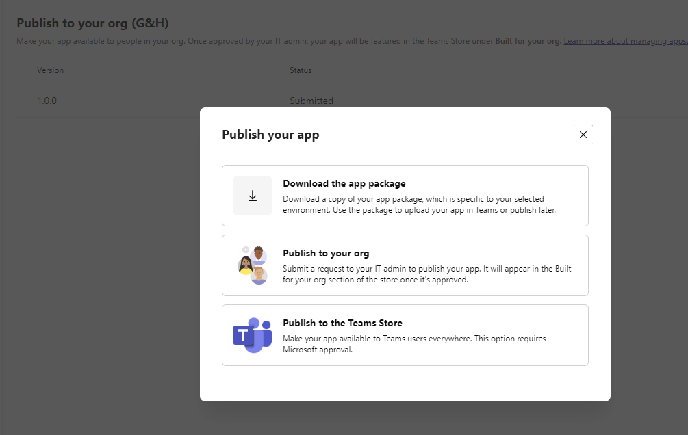

# Concept Paper: Enabling CLSS Notifications

The purpose of this document is to evaluate options for incorporating
notification functionality in the CLSS. Enabling a notification feature
would ensure that key personnel are alerted to important events as they
happen with the intended outcome of informing and in some cases, driving
action. Notifications can include detailed information from CLSS, and
links for the user to open the CLSS App. They can also provide a means
for the user to respond, for example by providing a comment on an
indicator assessment.

The CLSS is built on an ArcGIS infrastructure, which supports Feature
Service webhooks that can be used to trigger HTTP POST requests
triggered by an event. Supported events include FeaturesCreated,
FeaturesUpdated, FeaturesDeleted, or wildcard events (‘\*’) that trigger
based on anytime an event is triggered.

Notifications within CLSS may be delivered through a variety of
different communication channels, including email, text (SMS), and
Microsoft Teams, providing flexibility based on the needs and
communication preferences of different users. Furthermore, as the system
evolves, future integration with alerting platforms such as Everbridge,
allowing CLSS to align with broader emergency communication strategies.

Potential cases involving notifications:

- **New assessment created**: After a new assessment has been created,
  notify users so they can update the status of impacted lifeline
  indicators

- **Assessment set to completed**: When an assessment is completed,
  notifications will ensure users are aware and able to access the
  comprehensive lifeline report promptly.

- **Indicator or component status change**: If a specific lifeline
  indicator reaches a critical threshold, such as a 100% impact level
  for "Significant" or "Moderate" damage, inform appropriate teams are
  informed immediately to mitigate risks and allocate resources
  effectively. Notify users when an indicator or component status
  changes, for example if a Significant Impact is reported, or if a
  downward trend is identified.

- **Linked data status change**: Notify users when a status change is
  detected in a dataset registered in CLSS and linked to an assessment.
  The notification may be triggered by linked data exceeding a
  pre-established threshold.

This document evaluates four notification platforms—Microsoft Power
Automate, AWS, Azure, as well as a custom on premises deployment—
exploring the scalability, customization, and integration options for
these platforms. By examining the technical trade-offs and capabilities
of each, this report provides recommendations on the most suitable
approach to ensure that CLSS notifications are effective, reliable, and
scalable for future needs. To provide a more comprehensive view of a
single platform, this document also includes a deep-dive into a
PowerAutomate use case.

## Comparison of Notification Platforms: 

| **Platform** | **Details** | **Pros** | **Cons** |
|----|----|----|----|
| **Power Automate** | Power Automate offers a low-code solution for integrating with Microsoft tools such as Teams, Outlook (email), and third-party services via connectors (e.g., Twillio for SMS messages). Notifications can be triggered based on data changes in CLSS, such as the creation of new assessments or updates to indicator values. | Easy to use and integrate with other Microsoft services; ideal for users already within the Microsoft ecosystem. Many prebuilt connectors available to connect to third-party systems. Minimal coding is required, making it faster to deploy. | Limited customization options, especially for complex workflows. It may not scale well for high volumes of notifications and lacks advanced monitoring capabilities. Moderate costs incurred for Premium Connectors (requires Power Automate Premium plan). |
| **AWS** | Lambda allows for highly customizable event-driven notifications using serverless architecture, including EventBridge to setup an HTTP Listener. You can trigger notifications via Amazon Simple Notification Service (SNS) for SMS or email alerts based on changes in assessment data. Teams messages can be triggered by using Graph API. | Scalable, pay-per-use, and highly flexible. Suitable for large-scale operations with a need for complex and tailored notifications. Integration with various AWS services provides a broad range of possibilities for customization and automation. | Requires more development resources and AWS expertise to configure and manage. AWS pricing for Lambda and SNS could become costly depending on the volume of notifications. |
| **Azure** | Similar to AWS Lambda, Azure Functions is a serverless option that allows you to trigger notifications when specific events occur in CLSS. Azure Logic Apps or SignalR can be integrated for sending notifications via Teams, SMS, or email. | Well-suited for organizations already utilizing Azure services. Scalable and allows advanced customization of workflows. Seamless integration with Microsoft services and other Azure-based resources. | Requires more development effort compared to Power Automate. Although it’s scalable, it requires careful management and monitoring of azure functions to avoid unexpected costs. |
| **On Premises Notification Solution** | For organizations deploying CLSS on premises, there are options to configure local webserver technology (e.g., IIS, Apache) with webhook handlers. | On premises solutions provide a high level of control for handling webhooks configured on ArcGIS Enterprise to a local email server or other communication channels. | Requires substantial investment in configuration and management to deploy notification solution internally. |

## PowerAutomate

PowerAutomate is a powerful and easy to configure SaaS offering for
automating workflows and business processes. A PowerAutomate standard
account is included with all Office365/Microsoft365 licenses, premium
licenses are required for any Premium connectors (including ArcGIS
connector).

Steps to configure a
notification workflow in PowerAutomate:

1)  Setup environment: Used GH Dev Environment
2)  Created new solution called [CLSS
    Dev](https://make.powerautomate.com/environments/4889dca5-dee5-ee7b-b377-61e1002e011b/solutions)
3)  Created PowerAutomate flow: CLSS_GetNewAssessment_ArcGIS: [Edit your
    flow \| Power
    Automate](https://make.powerautomate.com/environments/4889dca5-dee5-ee7b-b377-61e1002e011b/solutions/db35708e-0a6a-ef11-a670-000d3a1fc4b4/flows/67130bec-6932-4945-adc2-6a7dd8eb5ea7?v3=false)
    using [CLSS Dev Feature
    Service](https://ghis.maps.arcgis.com/home/item.html?id=4cec9a93384543e0a676e3ad892362bb)
4)  Configured PowerAutomate flow using the ArcGIS Connector as the
    Action Trigger for the flow.

**Examples of Notifications triggered by PowerAutomate**

| Teams Message containing update regarding new Assessment, with link to jump to Assessment to complete it. | 
 |
|----|----|
| SMS Message sent by Twillio connection in PowerAutomate. | 
 |
| Email Notification sent with Outlook v2 connector | 
 

### Limitations

- Maximum of 10 webhooks can be set on any Feature Service (webhook
  added for every PA flow created)

## 

## On Premise Options

## Reference Material

- [Web Hooks (Feature Service)—ArcGIS REST APIs \| ArcGIS
  Developers](https://developers.arcgis.com/rest/services-reference/online/web-hooks-feature-service-.htm)
- [Create a hosted feature service
  webhook](https://www.esri.com/arcgis-blog/products/arcgis-online/sharing-collaboration/how-to-create-a-hosted-feature-service-webhook/?srsltid=AfmBOopBOkpPTVU4bllotJ_J1uNhR0TORed3Kh3U1unRA9xU3m_qhPAP)
- [Listener Adapters \<listenerAdapters\> \| Microsoft
  Learn](https://learn.microsoft.com/en-us/iis/configuration/system.applicationhost/listeneradapters/)
- [Set up the ArcGIS Enterprise connector—ArcGIS for Microsoft 365 \|
  Documentation](https://doc.arcgis.com/en/microsoft-365/latest/power-automate/set-up-the-arcgis-enterprise-connector.htm)
- [Get started with ArcGIS Connectors for Power Automate—ArcGIS for
  Microsoft 365 \|
  Documentation](https://doc.arcgis.com/en/microsoft-365/latest/power-automate/get-started-with-arcgis-connectors-for-power-automate.htm)
- [ArcGIS - Connectors \| Microsoft
  Learn](https://learn.microsoft.com/en-us/connectors/arcgis/)

## ArcGIS WebHooks

You can create, view, and manage webhooks by going to the Admin REST
Endpoint URL for a feature service, for example:  
<https://services3.arcgis.com/j2a3SeWN04oskFYa/ArcGIS/rest/admin/services/CLSS_FeatureService_Dev/FeatureServer>

**Webhook designed to trigger Power Automate Flow when Assessment
Feature Is Created**

| Name: | power-automate-084d2163c66147cd9d982a6738cd87a8-FeaturesCreated |
|----|----|
| Id: | 42 |
| GlobalId: | c4140321-a0d2-458b-b9be-c23ddb9aa246 |
| Owner: | clssdev_ghis |
| HookUrl: | https://prod-46.westus.logic.azure.com/workflows/084d2163c66147cd9d982a6738cd87a8/triggers/When_a_record_is_created_in_a_feature_layer/versions/08584760452488240747/run?api-version=2016-06-01&sp=%2Ftriggers%2FWhen_a_record_is_created_in_a_feature_layer%2Fversions%2F08584760452488240747%2Frun%2C%2Ftriggers%2FWhen_a_record_is_created_in_a_feature_layer%2Fversions%2F08584760452488240747%2Fread&sv=1.0&sig=ZmnIEJ8aFuhZ4BRx7t5Qgdd16DDUDxTFjN-UT7mzNIg |
| Active: | True |
| Payload Format: | json |
| Content Type:: | application/json |
| Change Types:: | FeaturesCreated |
| Creation Time: | 9/5/2024 6:40:39 PM |
| Last Update Time: | 9/5/2024 6:40:41 PM |
| Schedule Info: | {"name":"","state":"enabled","recurrenceInfo":{"frequency":"second","interval":30}} |
| Signature Key: |  |
| ServerGen:: | 2672198 |

**Webhook designed to trigger Power Automate Flow when Assessment
Feature Is Updated**

| Name: | power-automate-f70019db7f08477b8d9a9d0bb28d48a2-FeaturesUpdated |
|----|----|
| Id: | 45 |
| GlobalId: | 26f5a761-6343-4ce7-8c0b-71f8e0418da1 |
| Owner: | clssdev_ghis |
| HookUrl: | https://prod-152.westus.logic.azure.com/workflows/f70019db7f08477b8d9a9d0bb28d48a2/triggers/When_a_record_is_updated_in_a_feature_layer/versions/08584759579924406866/run?api-version=2016-06-01&sp=%2Ftriggers%2FWhen_a_record_is_updated_in_a_feature_layer%2Fversions%2F08584759579924406866%2Frun%2C%2Ftriggers%2FWhen_a_record_is_updated_in_a_feature_layer%2Fversions%2F08584759579924406866%2Fread&sv=1.0&sig=un1htlvNF49qtEiPvOwmrx3vkAaZCM2Sb8w1ohkAFYw |
| Active: | True |
| Payload Format: | json |
| Content Type:: | application/json |
| Change Types:: | FeaturesUpdated |
| Creation Time: | 9/6/2024 6:54:54 PM |
| Last Update Time: | 9/6/2024 6:54:55 PM |
| Schedule Info: | {"name":"","state":"enabled","recurrenceInfo":{"frequency":"second","interval":30}} |
| Signature Key: |  |
| ServerGen:: | 2680815 |

**Webhood Designed to trigger AWS CloudWatch/Lambda Function**

| Name: | aws-lambda-webhook |
|----|----|
| Id: | 43 |
| GlobalId: | 357dab9a-976a-42d8-b723-70106dd14474 |
| Owner: | clssdev_ghis |
| HookUrl: | https://fjfwhje8ge.execute-api.us-east-1.amazonaws.com/default/clssDev_NewAssessment |
| Active: | False |
| Payload Format: | json |
| Content Type:: | application/x-www-form-urlencoded |
| Change Types:: | FeaturesCreated |
| Creation Time: | 9/5/2024 7:23:14 PM |
| Last Update Time: | 9/5/2024 7:23:14 PM |
| Schedule Info: | {"name":"","state":"enabled","recurrenceInfo":{"frequency":"second","interval":30}} |
| Signature Key: |  |
| ServerGen:: | 2672244 |
